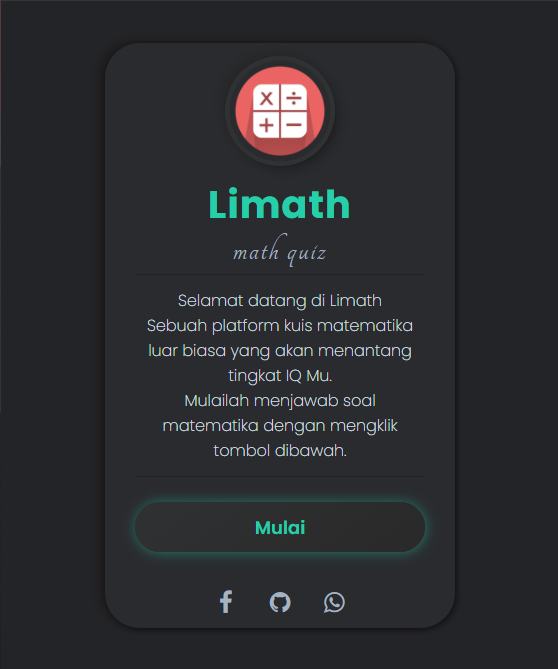

# Limath

Limath adalah platfrom quiz matematika berbasis website yang dikembangkan oleh Alief Ramadhan lalu diluncurkan bulan Mei 2021. Sebelum dikembangkan awalnya bernama Mathematics dan didirikan oleh Wafa Rifki Anafin, seorang Web Design.

# About Project
Kata Limath terinsiparsi dari nama depan saya { Li } dan ini adalah platform kuis matematika jadi dinamakan Limath. Awal mula Limath berawal dari status fb temen saya yg membuat website dengan nama mathematics. Saya mencoba nya, sesaat berada di halaman web tersebut mata saya tertuju dengan tampilan nya, dari segi warna dan kerapihan memberikan saya sebuah ide. Bagaimana jika website ini saya kembangkan menjadi sebuah platform kuis matematika yang bisa digunakan semua orang di dunia untuk menantang kecerdasan IQ nya, disitulah bermula nya Limath didirikan.

# Demo Site | Mathematics
<a href="https://bit.ly/mathematics-tes/">https://bit.ly/mathematics-tes/</a>

# Demo Site | Limath
<a href="https://itsmelief.github.io/limath/">https://itsmelief.github.io/limath/</a>

# ScreenShot

# Let's connect with me!

    
    
    

# Note 
Ini masih percobaan dan saya meminta saran/kritik dari kalian yang mencoba nya. Hubungi saya segera melalui sosmed saya yang tertera :) dan saya mengajak kalian yang mau membangun Limath ini hingga bisa digunakan oleh semua orang dari berbagai penjuru dunia dan bisa diakses melalui berbagai perangkat. 
"Saya hanya seorang pemula, dan saya tidak bisa membangun ini sendirian. Saya butuh kalian, ayo bangun Limath bersama-sama" 

# License
Didistribusikan di bawah MIT Licensi. Lihat `LISENSI` untuk informasi lebih lanjut.
